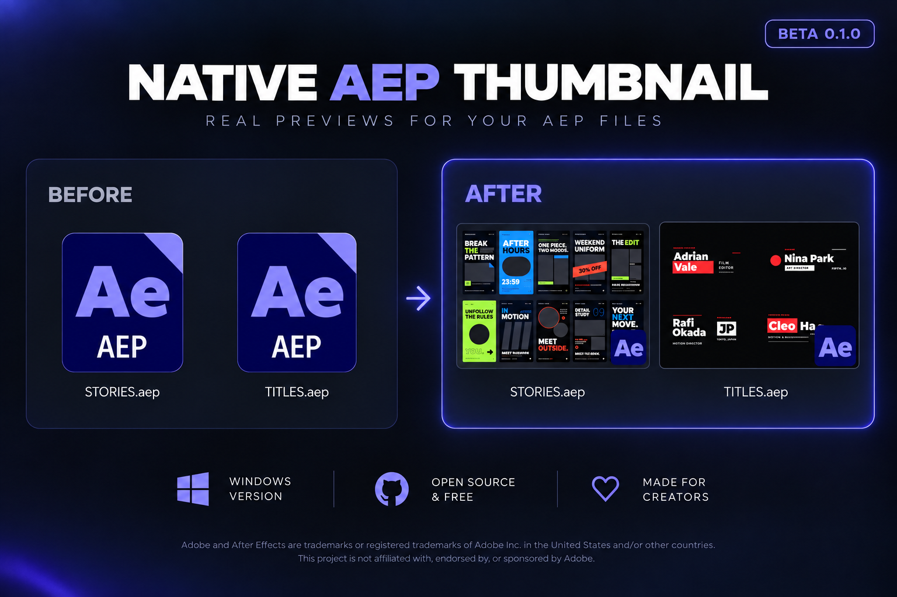

# Native AEP Thumbnail



**Real previews for your `.aep` files, right in Windows Explorer.**

Browse a folder of After Effects projects and see what is actually inside them —
the rendered frame, not an icon and not a metadata card.

> **Status:** beta `0.1.0`. Windows only. Works, tested on real project
> libraries, but the main-comp heuristic and the render settings are still being
> tuned.

<p align="center">
  
</p>

---

## Why this does not already exist

A PSD codec does not render anything. Photoshop stores a flattened composite
inside the file, and the codec simply decodes it. That is why PSD thumbnails
are instant and why third-party PSD codecs exist at all.

**An `.aep` contains no pixels whatsoever.**

Scan one and you will find zero JPEG/PNG/TIFF signatures anywhere in the file.
Its XMP packet carries only `CreatorTool`, some dates and a `DocumentID` — no
`xmp:Thumbnails`. An `.aep` is a big-endian RIFF container (`RIFX` + `Egg!`)
holding the project *graph*: compositions, layer parameters, keyframes and
references to footage.

There is nothing to decode. To see what a project looks like you have to
render it, and only the After Effects engine can do that — effects, text
layout, shapes, expressions, blend modes and all.

So AepThumb splits the job in two:

| Component | Role | Cost |
| --- | --- | --- |
| `aepthumb.dll` | Shell thumbnail provider. Displays an already-rendered frame from a cache. Renders nothing itself. | instant |
| `aepbake.exe` | Drives After Effects to render one frame per project into that cache. | ~15 s to start AE, then ~1.3 s per project |

Baking happens once per project version. After that the tile is free forever.

---

## How it behaves

1. You open a folder of projects.
2. Each unbaked tile appears as a placeholder card, immediately.
3. The provider spools a copy of every unbaked project, queues it, and starts
   the baker.
4. After Effects launches **once for the whole batch** and renders a frame per
   project.
5. Tiles become real frames as they land, and stay cached until the project is
   edited.

Baking pauses while After Effects is open, so your own session is never
disturbed — a script sent to a running instance would execute inside it. It
resumes on the next folder view or scan.

There is nothing to configure and no service to run.

> **Why a spooled copy?** The shell hands a thumbnail provider an `IStream`,
> never a filename. That is exactly what allows the provider to stay inside the
> isolated `dllhost.exe` rather than being loaded into `explorer.exe`. Since it
> has no path to pass along, it writes the bytes it was given into a spool
> folder and lets the baker open that. The copy is deleted once the frame is
> cached.

---

## Requirements

- Windows 10 or 11, 64-bit
- Adobe After Effects (any recent version; located via the registry)
- In After Effects: **Edit → Preferences → Scripting and Expressions → "Allow
  Scripts to Write Files and Access Network"** must be enabled.
  Without it every render fails silently.

Without After Effects the provider still loads, but every tile stays a
metadata card — there is nothing to render with.

Check everything at once:

```
aepbake --doctor
```

```
AepThumb self-check

  [ ok ] After Effects: C:\Program Files\Adobe\Adobe After Effects 2025\Support Files\AfterFX.exe
  [ ok ] Scripts may write files (AE 25.6)
  [ ok ] Render script: C:\Program Files\AepThumb\bake_batch.jsx
  [ ok ] Explorer uses this provider for .aep

  cache  : 14 baked, 0 pending, 0 spooled
  baker  : idle
  AE now : closed
```

---

## Install

### From source

Needs Visual Studio 2022 C++ build tools and the Windows SDK.

```bat
build.cmd
install.cmd     :: asks for elevation
```

### Build a redistributable installer

With [Inno Setup 6](https://jrsoftware.org/isdl.php):

```bat
build.cmd
"C:\Program Files (x86)\Inno Setup 6\ISCC.exe" installer\AepThumb.iss
```

Produces `installer\Output\AepThumb-Setup.exe` — a single file to hand to
someone else. It installs to Program Files, registers the handler
machine-wide, adds a self-check shortcut, and reverses everything on uninstall.

Note that the installer is unsigned unless you sign it, so SmartScreen will
warn on first run.

### What installation touches

| Where | What | Why |
| --- | --- | --- |
| `HKLM\Software\Classes\CLSID\{8E76F525-…}` | the COM class | the shell refuses to activate a thumbnail provider registered per-user |
| `HKLM\Software\Classes\.aep\ShellEx\{e357fccd-…}` | the association, for `.aep`, `.aet` and the AE ProgID | so it works for every user on the machine |
| `%LOCALAPPDATA%\AepThumb\` | cache, queue, spool, logs | per-user, disposable |

Process isolation is **left on** — there is no `DisableProcessIsolation`, so a
fault in this DLL cannot take Explorer down with it.

Any handler that already claimed `.aep` is saved under the CLSID's
`PreviousHandlers` key and restored on uninstall. On the machine this was built
on that was the Ardfry PSD codec, which claims `.aep` but cannot produce
anything for it — which is precisely why AEP tiles were blank.

---

## Commands

```
aepbake --scan  <folder> [-r]    bake every project in a folder now
aepbake --watch <folder> [-r]    bake, then keep baking as files change
aepbake --queue <project.aep>    bake one project
aepbake --doctor                 check the whole setup
aepbake --status                 cache and queue counts
aepbake --clear                  drop cached frames so they re-bake
```

`--scan` is only for warming a library up front; normal browsing does not need
it.

### Panic switch

```bat
toggle.cmd
```

Run it once and previews are off: the handler is unregistered, the previous
`.aep` handler is put back, the baker is stopped and the Windows thumbnail
cache is flushed, so files look exactly as they did before AepThumb existed.
Run it again and everything comes back.

Nothing is uninstalled and no baked frames are discarded, so switching back on
is instant. The file is self-contained — copy it anywhere.

### Inspect a project without touching the shell

```bat
build\aepinfo.exe "project.aep" -o out.png -s 512
```

Prints the parsed structure, says whether a frame is cached, and renders the
tile it would hand to Explorer.

---

## Known limits

- **Offline footage renders as colour bars.** If a project's media lives on a
  drive that is not mounted, After Effects renders its own media-offline bars
  and that is what gets cached. Mount the drive and run `aepbake --clear`.
  Projects built from shapes and text are unaffected.
- The first frame of each project costs a few seconds.
- Frames are rendered at draft quality and half resolution, then cached with
  the longest side at 1024px. Good for tiles, not a preview replacement.
- `.aepx` (the XML project format) is not handled; the parser expects RIFX.
- Projects over 256 MB are not spooled on first view — point `--scan` at them.

---

## How the cache works

```
%LOCALAPPDATA%\AepThumb\
├─ cache\<key>.png     baked frame, longest side 1024
├─ queue\<key>.job     pending request
├─ spool\<key>.aep     copy awaiting a bake, deleted afterwards
├─ aepbake.log         what the baker did
├─ bake_jsx.log        what After Effects reported
└─ provider.log        only written when the provider hits a problem
```

The key is an FNV-1a hash of the project's **bytes**, not its path. This is
what lets the provider work from a stream, and it has two useful consequences:
editing a project changes its key, so the cache invalidates itself, and two
copies of the same project share one baked frame.

## Which frame you get

The comp is whichever one the parser scores highest: render-target names
(`main`, `final`, `render`, `master`, `preview`) win, shallow position in the
project folder tree and delivery-sized dimensions help, layer count breaks
ties, and rig comps (`control`, `guide`, `null`, …) are penalised. After
Effects falls back to the largest comp if that name is gone.

The frame is the comp's **stored time indicator** — the author's own chosen
frame, the same one After Effects shows in its Project panel. If that sits on
frame 0, which is usually still black, it falls back to a quarter of the way
in.

Until a frame is baked, the tile falls back to a rendered preview beside the
project (`name.aep.png`, `name.png`, `_previews\name.png`), then the largest
still the project references, then a metadata card. Real frames are drawn
plain — no badge, no caption.

---

## AEP format notes

Reverse-engineered while building this; useful if you are parsing `.aep`
yourself.

Chunk tree: `RIFX` `Egg!` → top-level chunks → `LIST:Fold` → one `LIST:Item`
per project item. An item carries `idta` (type) and `Utf8` (name), then:

| Child | Means |
| --- | --- |
| `cdta` | the item is a composition |
| `LIST:Pin ` | the item is footage |
| `LIST:Sfdr` | the item is a folder; recurse into it |
| `LIST:Layr` | one layer of a comp (count them) |

Footage paths are JSON inside the `alas` chunk, in the `fullpath` field.

Fields inside `cdta`, verified against four unrelated projects including comps
sized 796×854, 606×54 and 216×19:

| Offset | Type | Meaning |
| --- | --- | --- |
| `0x8c` | `uint16` | width |
| `0x8e` | `uint16` | height |
| `0x9c` | 16.16 fixed | frame rate |

The value at `0x2c` is **identical for every comp in a project**, including
precomps of completely different lengths — it is not per-comp duration. This
tool deliberately does not report duration.

---

## After Effects automation notes

Every one of these cost real debugging time. Measured on AE 25.6.

- **Never call `app.beginSuppressDialogs()` around a render.** With suppression
  on, any project whose render would raise a warning — a missing effect,
  offline footage — stops instantly as `USER_STOPPED` (3018) and writes
  nothing. With suppression off the same project finishes as `ERR_STOPPED`
  (3019) and the frame lands on disk. Test for the output file; never trust the
  queue status.
- `AfterFX.exe -noui -r <script>` works, but the path after `-r` must **not**
  be quoted. Quote it and AE exits in about 5 seconds having run nothing. Pass
  the 8.3 short path so spaces survive unquoted.
- `comp.saveFrameToPng` and `comp.saveDraftFrameToPng` exist and throw nothing,
  but silently write no file when AE runs headless. Use the render queue.
- An output module's `Format` is read-only through `setSettings`; the format has
  to come from `applyTemplate`. `TIFF Sequence with Alpha` is a stock template
  and GDI+ can decode its output.
- Applying a **render-settings** template resets the time span. Set your
  single-frame range *after* `applyTemplate`, or you will render the entire comp
  (300 frames and 2.9 GB, in one memorable case).
- A sequence output module appends a frame number, so the output path needs
  `[#####]` before the extension or the final rename fails with error 784.
- `app.exitCode` does not reach the process exit code, and a script blocked from
  writing files leaves no trace at all. To prove a script ran, time a
  deliberate busy-loop against a baseline launch.
- Locate After Effects via `HKLM\SOFTWARE\Adobe\After Effects\<ver>\InstallPath`
  rather than guessing folder names.

---

## Layout

```
src/aep.{h,cpp}         RIFX parser and main-comp heuristic
src/cache.{h,cpp}       content-keyed cache, queue, spool, baker mutex
src/render.{h,cpp}      tile drawing: baked frame, or the placeholder card
src/thumb.cpp           COM thumbnail provider, registration, spool-and-queue
src/bake.cpp            aepbake.exe: queue, batching, watch, doctor
tools/bake_batch.jsx    the script After Effects runs
tools/aepinfo.cpp       CLI: dump a project, render its tile
installer/AepThumb.iss  Inno Setup script for the redistributable
build.cmd               build all three binaries
install.cmd             register (elevates)
uninstall.cmd           unregister and remove
toggle.cmd              panic switch: off, then on again
refresh-thumbnails.cmd  flush the Windows thumbnail cache
```

---

## Contributing

Issues and pull requests are welcome. The parts most likely to need work from
other people's project libraries:

- the **main-comp heuristic** in `AepPickMainComp` — which comp a human would
  call the project's cover shot;
- **`cdta` fields** beyond width, height and frame rate;
- `.aepx` (XML project) support, which is not implemented at all.

`build\aepinfo.exe "project.aep" -o out.png -s 512` prints what the parser sees
and renders the tile, which is the fastest way to check a change without
touching the shell.

## License

[MIT](LICENSE) — open source and free, do what you like with it.

## Trademarks

Adobe and After Effects are trademarks or registered trademarks of Adobe Inc.
in the United States and/or other countries. This project is not affiliated
with, endorsed by, or sponsored by Adobe.
